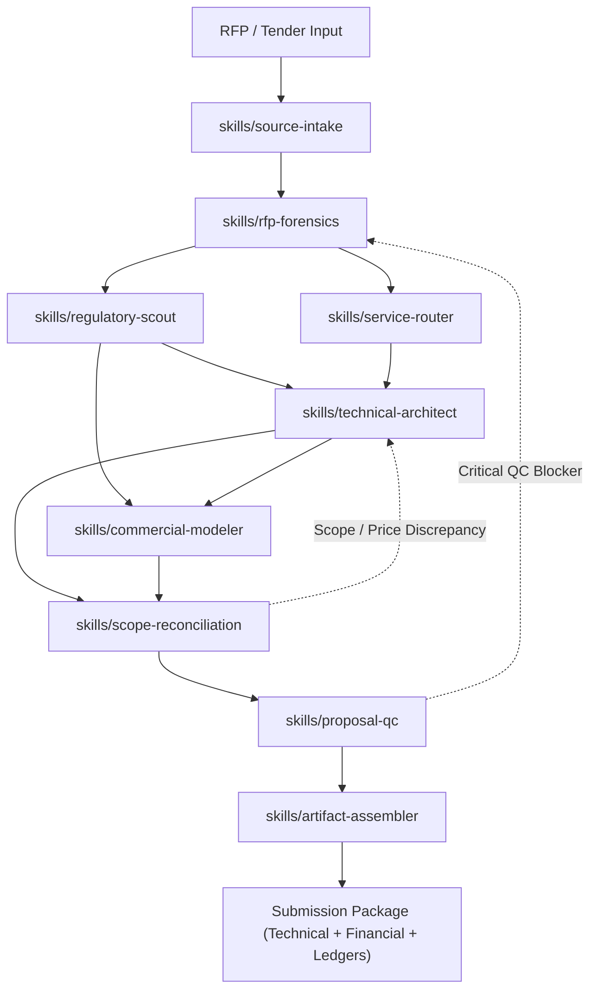

# Saudi MarCom Proposal Skill Pack

A provider-neutral agentic Skill Pack for architecting, authoring, and auditing tailored Saudi technical and financial proposals across media, corporate communications, marketing, promotion, events, crisis and reputation, digital and AI, monitoring, production, and adjacent services.

## Architectural Model: Atomic Neural-Connected DAG

The skill pack is organized as a **Master Dynamic Orchestrator** (`SKILL.md`) driving a **Directed Acyclic Graph (DAG)** of 9 discrete, fully self-contained atomic skills under `skills/` connected via the `neural_links` protocol:



## The 9 Atomic Skills Suite

| # | Skill Directory | Canonical Entrypoint | Core Responsibility |
|---|---|---|---|
| 1 | `skills/source-intake/` | `SKILL.md` | Ingestion, document inventory, situation classification, confidentiality quarantine |
| 2 | `skills/rfp-forensics/` | `SKILL.md` | Clause decomposition, requirement ledger, scoring rubric, clarification log |
| 3 | `skills/regulatory-scout/`| `SKILL.md` | Live Saudi checks: Etimad GTPL, Local Content, ZATCA VAT, PDPL, GCAM, GEA |
| 4 | `skills/service-router/` | `SKILL.md` | Multi-stream scope routing across 6 MarCom families and interface boundaries |
| 5 | `skills/technical-architect/`| `SKILL.md`| Technical proposal (العرض الفني), deliverable units, RACI, schedule, risk register |
| 6 | `skills/commercial-modeler/` | `SKILL.md` | Financial model (العرض المالي), client BOQ (جدول الكميات والأسعار), payment milestones |
| 7 | `skills/scope-reconciliation/`| `SKILL.md`| Bidirectional 2-way verification: every deliverable priced $\leftrightarrow$ every charge justified |
| 8 | `skills/proposal-qc/` | `SKILL.md` | Adversarial red-team evaluation, compliance falsification, zero-leakage audit |
| 9 | `skills/artifact-assembler/` | `SKILL.md` | Deliverable compilation, Arabic RTL layout fidelity, separate/combined packages |

## Minimum Inputs for a Final Bid

- RFP or approved brief
- Submission deadline and platform format
- Bidder credentials and approved case facts
- Commercial rate cards, vendor quotes, or pricing parameters
- Prescribed client templates or mandatory BOQ
- Clarification Q&A and issued addenda

If inputs are incomplete, the skills produce an assumptions-led draft with an explicit missing-input list rather than inventing facts.

## Non-Negotiable Invariants

1. **Source Before Prose**: Never write requirements from memory when the RFP or official source can answer it.
2. **Evidence Before Claims**: Zero fabricated credentials, case stats, audience reach, or permit status.
3. **Strict Scope-to-Price Parity**: Every technical promise must be funded; every BOQ line must have scope purpose.
4. **Zero Unsourced Pricing**: Missing commercial inputs remain marked as `PRICING INPUT REQUIRED`.
5. **Mandatory Form Preservation**: Government BOQ tables and declarations retain original structure.
6. **Relevance-Gated Saudi Regulations**: Live-check only authorities that directly govern the scope.
7. **Zero Client Leakage**: Scrub past client names, numbers, account details, and confidential case facts.

## Verification & Evaluation Suite

Run the static validation and behavioral evaluation suites locally:

```bash
# Validate master orchestrator and all 9 atomic skills (<500 lines, neural links, secrets)
python3 scripts/validate_pack.py

# Evaluate atomic skills against /skill-evaluator and /omni-skill standards
python3 scripts/eval_atomic_skills.py

# Run scenario behavioral test bank
python3 scripts/run_static_evals.py
```
