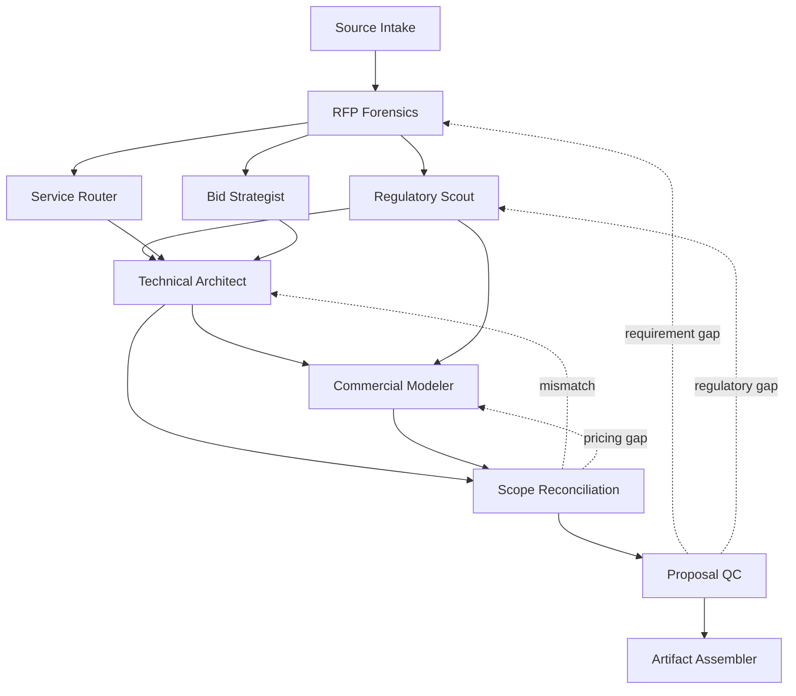

# Saudi MarCom Proposal Skill Pack

A provider-neutral agentic operating system for preparing, reviewing, and packaging tailored Saudi technical and financial proposals across corporate communications, media, marketing, promotion, events, crisis and reputation, digital products, AI, monitoring, and production.

Version 0.3 deepens the pack from a linear proposal workflow into a guarded state machine.

## What changed in v0.3

The pack now treats a bid as one persistent evidence model. Every specialist reads and writes the same `bid_state`, while guarded neural links control when downstream work is allowed.

Key additions:
- buyer-context routing for government, semi-government, private, and direct-award briefs
- `bid-strategist` skill for evaluation weights, proof strategy, win themes, and bid/no-bid evidence
- regulatory effective-state resolver that distinguishes announced, enacted, effective, superseded, and unknown rules
- capacity-aware commercial modeling instead of price-table-only behavior
- semantic technical-financial reconciliation across SLA, languages, geography, rights, timing, revisions, and operating coverage
- provider-neutral tool registry and independent reviewer adapter contract
- trace-oriented behavioral eval contract

## Architecture



The neural graph lives at `neural-links/graph.yaml`. The shared state contract lives at `schemas/bid-state.schema.json`.

## Principle

The technical proposal and the financial proposal are two projections of the same scope model.

That means a promise such as "24/7 monitoring with 30-minute escalation" cannot pass if the commercial model only funds business-hours coverage. The reconciliation node blocks release until the capacity, SLA, and price basis agree.

## Regulatory behavior

The skill does not assume that an announced Saudi rule is already effective.

For each triggered regulatory domain it records:
- authority
- instrument
- status
- publication date
- effective date if verified
- checked date
- official source
- technical implication
- commercial implication

This is especially important during procurement-law transitions and when authority names, permit services, or implementation guidance change.

## Commercial behavior

The financial model never fabricates final market prices.

Allowed final pricing bases:
- approved bidder rate card
- verified bidder cost basis
- current supplier quote
- client contractual schedule
- explicitly authorized commercial assumption

Public or historical benchmarks may guide unit structure and scenario design, but they do not become final prices by inference.

## Using internal references

Private prior proposals are used only for patterns such as:
- proposal anatomy
- deliverable units
- approval flows
- multilingual operations
- event production dependencies
- monitoring and crisis coverage models
- pricing table structure

Client names, private rates, account information, and unverified case claims are excluded.

## Verification

Run:

```bash
python3 -m pip install -r requirements.txt
python3 scripts/validate_pack.py
python3 scripts/run_static_evals.py
```

Behavioral maturity still requires a real agent harness that records route decisions, evidence receipts, tool traces, gates, and final outputs. Static validation alone is not a behavioral proof.

## Optional external reviewers

Code-review or plugin-evaluation systems can be connected through `tools/reviewer-adapter-contract.md`.

They are independent evidence sources, not release authorities. A reviewer result cannot bypass the pack's own hard gates.
