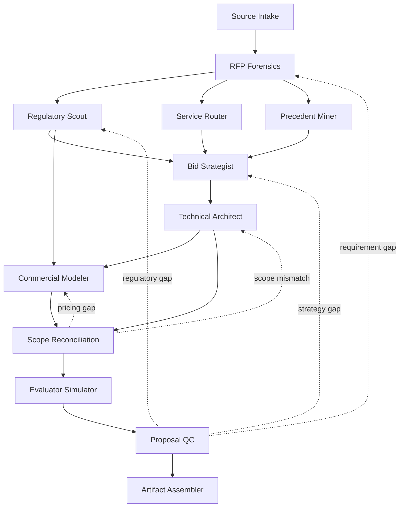

# Saudi MarCom Proposal Skill Pack

A provider-neutral agentic operating system for preparing, reviewing, and packaging tailored Saudi technical and financial proposals across corporate communications, media, marketing, promotion, events, crisis and reputation, digital products, AI, monitoring, and production.

Version 0.4.1 uses a guarded shared bid state so evidence, scope, capacity, regulation, pricing, evaluation strategy, and release decisions stay synchronized.

## Architecture

The pack currently contains 12 atomic skills:

1. source-intake
2. rfp-forensics
3. regulatory-scout
4. service-router
5. precedent-miner
6. bid-strategist
7. technical-architect
8. commercial-modeler
9. scope-reconciliation
10. evaluator-simulator
11. proposal-qc
12. artifact-assembler



The neural graph lives at `neural-links/graph.yaml`. The shared state contract lives at `schemas/bid-state.schema.json`.

## Core principle

The technical proposal and the financial proposal are two projections of one scope model.

A promise such as "24/7 monitoring with 30-minute escalation" cannot pass if the commercial model only funds business-hours coverage. Reconciliation blocks release until SLA, capacity, timing, language, geography, rights, dependencies, and price basis agree.

## Evidence and precedent

The pack treats sources by authority and provenance.

Private prior proposals can contribute:
- structure
- deliverable units
- operating patterns
- risk patterns
- evaluation lessons
- commercial table patterns

They cannot silently contribute:
- prior client names
- private rates
- confidential terms
- account information
- unsupported case metrics
- stale regulatory claims

`precedent-miner` must preserve provenance and reuse constraints.

## Saudi regulatory behavior

The regulatory layer resolves effective state rather than assuming an announcement is already binding.

For each applicable domain it records:
- authority
- instrument
- status
- publication date
- effective date when verified
- checked date
- official source
- technical implication
- commercial implication

Triggered domains can include procurement and Etimad, local content, VAT and tax, PDPL and data transfer, media and advertising, event permits, cybersecurity, telecom/digital services, and sector-specific controls.

## Commercial behavior

Final rates require an authorized basis:

1. approved bidder rate card
2. verified bidder cost basis
3. current supplier quote
4. client contractual schedule
5. explicitly authorized commercial assumption

A missing commercial basis remains unresolved. Public or historical benchmarks may inform structure or scenarios but do not become final prices by inference.

## Evaluator simulation

After technical-financial reconciliation, `evaluator-simulator` checks whether disclosed criteria and mandatory requirements are easy to locate and backed by proof.

It must not:
- invent hidden weights
- predict award
- invent evaluator intent
- convert internal completeness into a buyer score

## Tool and runtime policy

Canonical skills request capabilities, not provider brands.

See:
- `tools/tool-registry.yaml`
- `tools/runtime-adapter-map.example.yaml`
- `evals/harness-compatibility.md`
- `tools/reviewer-adapter-contract.md`

Missing capability must degrade explicitly. The pack never simulates a source read, live regulatory check, spreadsheet calculation, artifact render, reviewer run, or test result.

## Validation

Run the complete repository validation sequence:

```bash
python3 -m pip install -r requirements.txt
python3 scripts/security_scan.py
python3 scripts/validate_pack.py
python3 scripts/run_static_evals.py
python3 scripts/validate_runtime_adapters.py
python3 -m unittest discover -s tests -p "test_*.py"
```

Static validation proves repository contracts and fixture integrity. It does not prove agent behavior.

Behavioral maturity requires a live held-out harness run that records route decisions, evidence receipts, tool traces, state mutations, gates, blockers, and final outputs.

## Optional external reviewers

Code review, skill evaluation, security review, or document QA systems can connect through `tools/reviewer-adapter-contract.md`.

External reviewers are independent evidence sources, not release authorities. Their failure is not a clean review, and their findings cannot bypass hard gates.

## Release boundary

Do not call a bid package complete unless:
- mandatory requirements have traceable coverage
- current regulatory claims have effective-state receipts when relevant
- bidder claims are verified or downgraded
- commercial formulas and price bases are valid
- semantic reconciliation passes
- evaluator traceability has been checked
- no unresolved blocker remains
- client artifacts exclude internal-only data
- final files match required submission formats
