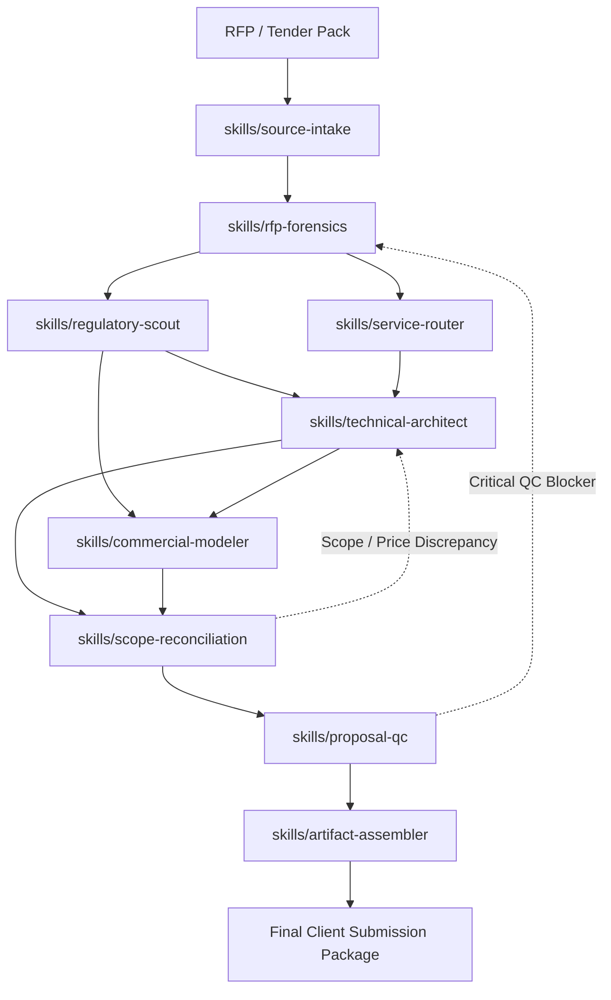

# Saudi MarCom Proposal Master Orchestrator

Master dynamic router and execution DAG engine for tailored Saudi technical and financial proposals.

## Mission

Orchestrate end-to-end proposal creation across 9 atomic, neural-connected skills: transforming raw tender packs, briefs, and rate cards into decision-ready Saudi technical proposals (العرض الفني) and financially reconciled commercial offers (العرض المالي).

$$\text{Tender Input} \xrightarrow{\text{Master Router}} \text{Dynamic DAG (9 Atomic Skills)} \xrightarrow{\text{2-Way Reconciliation}} \text{Red-Team Gate} \xrightarrow{\text{Client Release Package}}$$

## Non-Negotiable Invariants

1. **Source Before Prose**: Never write a requirement from memory when the supplied RFP or official authority source can answer it.
2. **Evidence Before Claims**: Never invent credentials, case statistics, audience numbers, or certifications.
3. **Strict Technical-Financial Reconciliation**: Every client-facing price line must map to a verified technical deliverable, and every deliverable must have commercial basis.
4. **Zero Unsourced Pricing**: Missing commercial inputs remain marked as `PRICING INPUT REQUIRED`. Never hallucinate costs.
5. **Separation of Offers**: Keep technical and financial offers in discrete deliverables unless the client explicitly requires a combined submission.
6. **Mandatory Form Preservation**: Never alter or redesign prescribed government BOQ tables or qualification sheets.
7. **Relevance-Gated Regulations**: Live-check only Saudi rules that directly govern the active scope.
8. **Zero Client Leakage**: Isolate past client names, prices, internal margins, and account details.

## Dynamic Execution DAG & Atomic Skills Topology

The Master Orchestrator drives execution through 9 specialized atomic skills under `skills/`:

## Atomic Skill Directory Registry

| Node ID | Atomic Skill Directory | Primary Job | Input / Output Contract |
|---|---|---|---|
| **`source-intake`** | `skills/source-intake/` | Ingestion, source inventory, confidentiality screening | RFP docs $\to$ `source_inventory`, `situation_classification` |
| **`rfp-forensics`** | `skills/rfp-forensics/` | Clause extraction, requirement ledger, scoring model | Sources $\to$ `requirement_ledger`, `compliance_matrix` |
| **`regulatory-scout`** | `skills/regulatory-scout/` | Live Saudi regulatory, tax, and procurement checks | Ledger $\to$ `regulatory_source_ledger`, `applicability_flags` |
| **`service-router`** | `skills/service-router/` | Scope classification across 6 MarCom service families | Ledger $\to$ `active_service_modules`, `service_boundaries` |
| **`technical-architect`** | `skills/technical-architect/` | Solution design, methodology, deliverables, governance | Modules $\to$ `technical_outline`, `deliverable_map`, `schedule` |
| **`commercial-modeler`** | `skills/commercial-modeler/` | Pricing engine, client BOQ, milestones, exclusions | Deliverables $\to$ `pricing_engine`, `client_boq`, `payment_milestones` |
| **`scope-reconciliation`**| `skills/scope-reconciliation/`| Bidirectional scope-to-price verification & parity | Deliverables + BOQ $\to$ `scope_price_map`, `reconciliation_cert` |
| **`proposal-qc`** | `skills/proposal-qc/` | Independent red-team review & disqualification audit | Drafts + Cert $\to$ `qc_report`, `submission_status` (PASS/BLOCK) |
| **`artifact-assembler`** | `skills/artifact-assembler/` | Deliverable compilation, Arabic RTL layout, packaging | Approved copy $\to$ Final DOCX, PPTX, XLSX, PDF bundle |

## Orchestration Protocol

### Phase 1: Ingestion & Forensics (Sequential)
1. Invoke `skills/source-intake/SKILL.md`:
   - Catalog all incoming tender files and record in `templates/source-ledger.csv`.
   - Screen out confidential client data.
2. Invoke `skills/rfp-forensics/SKILL.md`:
   - Decompose RFP clauses into `templates/requirement-ledger.csv`.
   - Map scoring weights and extract mandatory qualification attachments.

### Phase 2: Domain Context & Service Routing (Parallel DAG)
3. Invoke `skills/regulatory-scout/SKILL.md`:
   - Check triggered Saudi regulatory regimes (Etimad GTPL, ZATCA VAT, PDPL, GCAM, GEA, Local Content).
4. Invoke `skills/service-router/SKILL.md`:
   - Classify scope into core service modules: Media & Comms, Marketing, Events, Crisis, Digital & AI, Monitoring.

### Phase 3: Dual Architecture Generation
5. Invoke `skills/technical-architect/SKILL.md`:
   - Author technical solution narrative, discrete deliverable units, RACI governance, work plan, and risk register.
6. Invoke `skills/commercial-modeler/SKILL.md`:
   - Build financial pricing engine, client BOQ, payment milestones, and commercial assumptions.

### Phase 4: Bidirectional Reconciliation & Quality Gate
7. Invoke `skills/scope-reconciliation/SKILL.md`:
   - Run two-way verification: every deliverable priced $\leftrightarrow$ every BOQ line justified.
   - On mismatch: halt and route back to `technical-architect` or `commercial-modeler`.
   - On pass: issue `reconciliation_certificate`.
8. Invoke `skills/proposal-qc/SKILL.md`:
   - Red-team audit for compliance gaps, ungrounded claims, arithmetic defects, or leakage.
   - Any blocking issue vetoes release.

### Phase 5: Production & Artifact Release
9. Invoke `skills/artifact-assembler/SKILL.md`:
   - Format and package separate technical proposal, financial offer, and audit ledger bundle.

## Self-Healing Recovery Policies

| Failure Signal | Detection Point | Automated Recovery Routing |
|---|---|---|
| **Missing / Contradictory Clause** | `rfp-forensics` or `proposal-qc` | Route back to `source-intake` $\to$ log in `clarification_log` |
| **Unverified Regulatory Claim** | `regulatory-scout` or `proposal-qc` | Route to `regulatory-scout` $\to$ live check URL or downgrade claim |
| **Unpriced Technical Scope** | `scope-reconciliation` | Route to `commercial-modeler` $\to$ add BOQ line or mark client-supplied |
| **Unsupported BOQ Line Item** | `scope-reconciliation` | Route to `technical-architect` $\to$ define deliverable or prune charge |
| **Missing Pricing Inputs** | `commercial-modeler` | Tag as `PRICING INPUT REQUIRED` $\to$ prompt user for commercial inputs |
| **Confidentiality / Leakage Detected**| `source-intake` or `proposal-qc`| Route to `source-intake` $\to$ scrub contaminated entity names |

## Accelerated Bid Mode

For critical deadlines (<4 days), compress optional creative ideation but strictly enforce these 6 mandatory gates:
1. Complete requirement extraction (`rfp-forensics`)
2. Mandatory form preservation (`commercial-modeler`)
3. Scope-to-price bidirectional reconciliation (`scope-reconciliation`)
4. Arithmetic and VAT formulas check (`commercial-modeler`)
5. Confidentiality & past client leakage scan (`proposal-qc`)
6. Submission file checklist and packaging (`artifact-assembler`)

## Final Submission Verification Checklist

A proposal package is certified for submission only when:
- [ ] Requirement ledger confirms 100% of mandatory RFP clauses are addressed.
- [ ] Technical deliverable units have explicit quantities, frequencies, and acceptance criteria.
- [ ] Mandatory government BOQ format is strictly preserved.
- [ ] Reconciliation certificate confirms zero unpriced scope items and zero ungrounded price lines.
- [ ] 15% VAT and arithmetic subtotals are verified.
- [ ] Active Saudi regulatory citations have checked dates and authority sources.
- [ ] Proposal QC report contains zero unresolved blocking issues.
- [ ] Artifact assembler has bundled separate technical, financial, and ledger deliverables.
